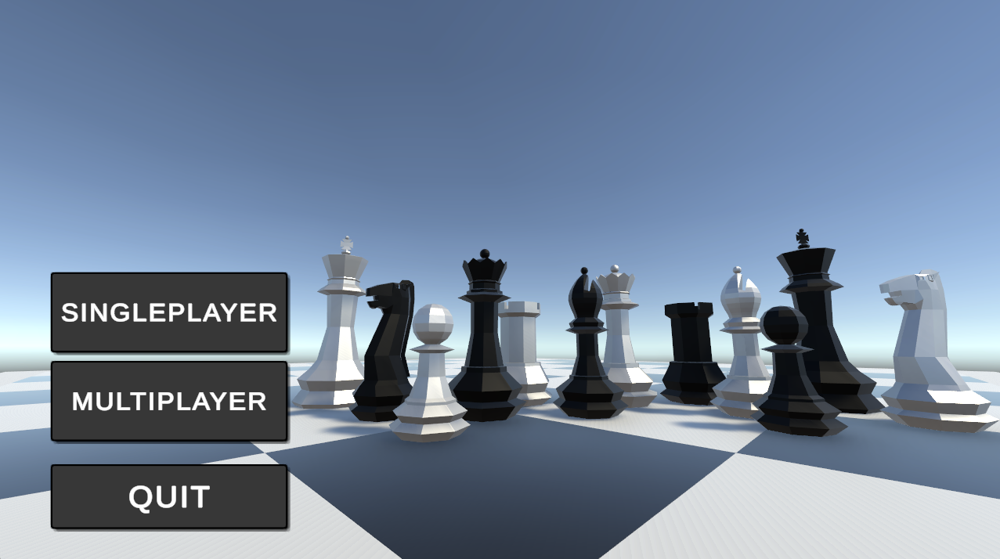
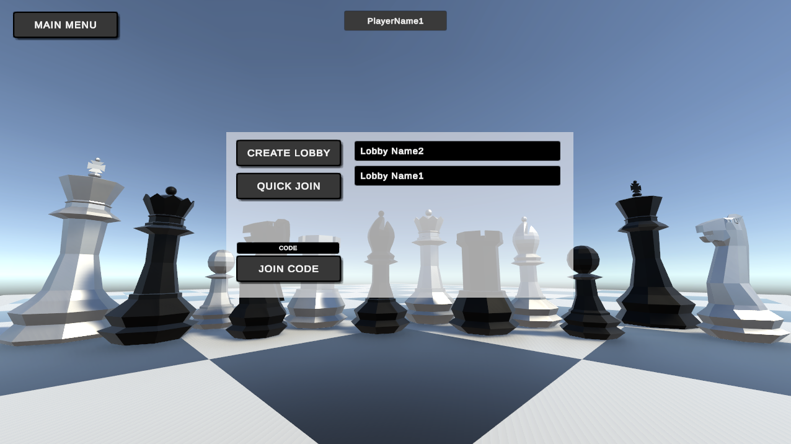
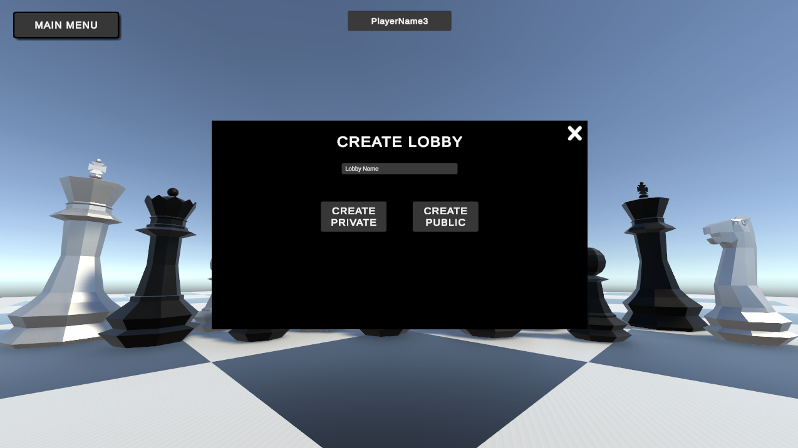
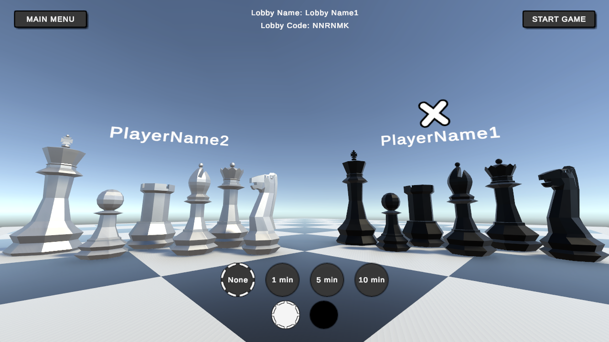
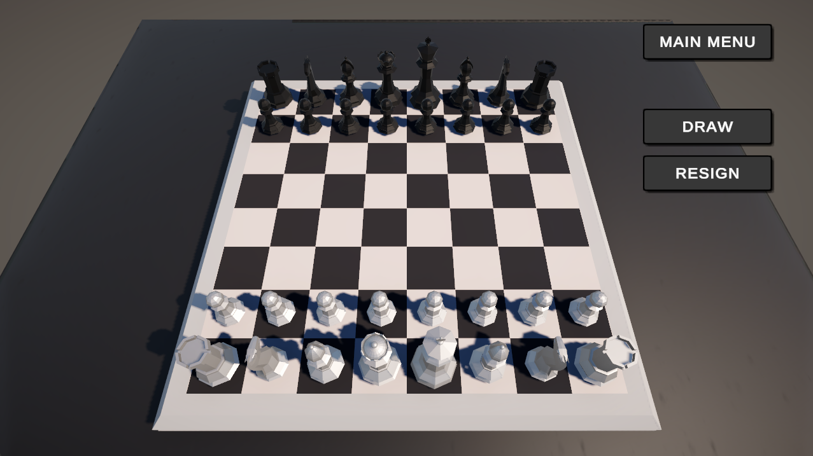
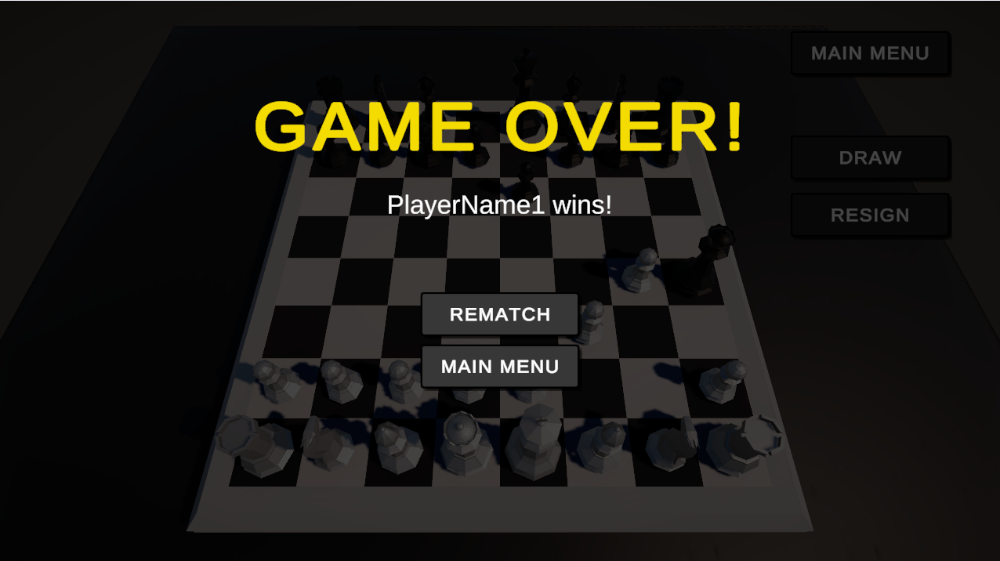

# Chess-Game
- Project for the course **Programming Paradigms** for 3rd year students on the  
Computer Science studies at the Faculty of Mathematics, University of Belgrade.
- Made in [Unity](https://unity.com/) and written in C#.

## Running
- The project is intended for the Windows operating system.
- Releases -> Version 0.1.0 -> Chess-Game.zip -> Extract files -> Chess Game.exe

## Images

## Unity Services
- [Lobby](https://unity.com/products/lobby)
- [Relay](https://unity.com/products/relay)

## Assets
- [Chess Set](https://assetstore.unity.com/packages/3d/props/low-poly-chess-set-board-and-timer-216547)
- [Chess Pieces Images](https://commons.wikimedia.org/wiki/Category:SVG_chess_pieces)
- [Table](https://assetstore.unity.com/packages/3d/props/furniture/patio-table-227263)
- [Sounds](https://www.chess.com/forum/view/general/chessboard-sound-files?page=2#comment-89885805)

## Course Details
- Academic Year 2023/24
- Assistant: [Milan Čugurović](http://poincare.matf.bg.ac.rs/~milan.cugurovic/)
- Professor: [Dr. Milena Vujošević Janičić](http://poincare.matf.bg.ac.rs/~milena/)

## Authors
- [Aleksandar Ilić](https://github.com/acailic02)
- [Petar Pavlović](https://github.com/PetarP02)
- [Veljko Deljanin](https://github.com/VeljkoDeljanin)
